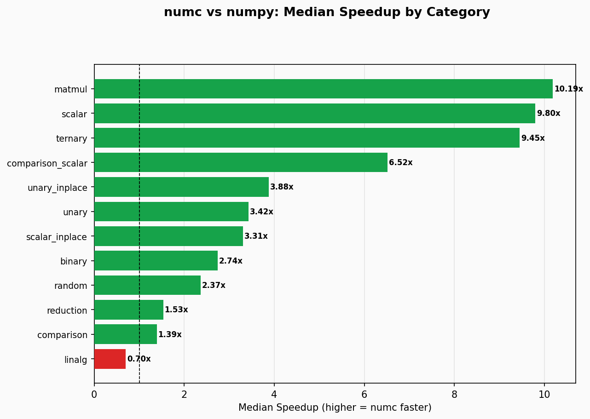

# numc: High-Performance N-Dimensional Tensor Library

`numc` is a blazingly fast C library engineered for high-performance N-dimensional array manipulation and tensor computation. Architected in pure **C23**, it provides a robust mathematical foundation for scientific computing, machine learning, and high-frequency data processing.

By synthesizing modern language features with hardware-aware architectural patterns, `numc` delivers deterministic performance that consistently outperforms industry-standard libraries in both raw throughput and cache efficiency.

## Key Architectural Advantages

- **Hardware-Informed Performance:** Leverages `__builtin_assume_aligned` for SIMD alignment and `__builtin_prefetch` to minimize cache miss penalties during strided N-D iteration.
- **Three-Tier Dispatch System:**
    1. **Accelerated Backend:** Automatic offloading of floating-point operations (`dot`, `matmul`, `sum`, `add`, `sub`) to **BLIS** or **OpenBLAS** (Level 1/2/3 BLAS) with SIMD intrinsics (AVX2, AVX-512, NEON, SVE, RVV).
    2. **Parallelized Engine:** Multi-accumulator **OpenMP** kernels for high-bandwidth integer and strided-floating operations.
    3. **Native Fallback:** Highly optimized, C23-native kernels for edge cases and small tensors.
- **Arena-Based Memory Management:** Utilizes a high-concurrency arena allocator (`NumcCtx`) for O(1) tensor lifecycle management, ensuring zero memory fragmentation and deterministic cleanup.
- **Zero-Copy Geometry:** Perform reshapes, transposes, and complex slicing via metadata manipulation, eliminating redundant data movement.
- **Modern C23 Foundation:** Built on the latest C standard for enhanced type safety and rigorous static analysis compatibility.

## Technical Capabilities

`numc` implements a comprehensive suite of operations for production-ready engineering:

- **Tensor Math:** Full support for binary arithmetic, unary functions, and scalar operations with broadcasting.
- **Transcendental Ops:** Hardware-accelerated `exp`, `log`, `sqrt`, and `pow`.
- **Advanced Reductions:** Multi-dimensional `sum`, `mean`, `max/min`, and `argmax/argmin` with axis-specific reduction logic.
- **Universal Broadcasting:** Strict adherence to NumPy-style broadcasting semantics across all dimension-mismatched operations.
- **N-Dimensional Support:** Every mathematical operation (excluding strictly 2D `matmul`) supports arbitrary N-D tensor shapes and strided memory layouts.

## Benchmarks

numc is rigorously benchmarked against NumPy across all supported operations, data types, and array configurations. The benchmark suite runs identical workloads on both libraries to ensure a fair comparison.



For the complete set of benchmark charts, device specifications, and per-operation breakdowns, see the [benchmark results](bench/graph/README.md).

To reproduce benchmarks on your own hardware:

```bash
./run.sh bench                                        # Run numc + numpy benchmarks
bench/graph/.venv/bin/python3 bench/graph/plot.py     # Generate comparison charts
```

Detailed benchmark methodology, CSV format documentation, and environment setup instructions are available in the [bench README](bench/README.md).

## TODO

### Performance — Help Wanted

These are known slow paths where numc loses to NumPy. Community contributions and ideas are welcome.

#### Matmul (BLAS float path)

BLIS sgemm/dgemm is 2–5x slower than NumPy's OpenBLAS at 128×128 through 1024×1024. The OpenBLAS vendored backend closes this gap but adds ~200 MB build weight. Finding the right default and tuning BLIS to match OpenBLAS performance is an open problem.

| Size | float32 (numc/numpy) | float64 (numc/numpy) |
|------|---------------------|---------------------|
| 128×128 | 2.3x slower | 2.6x slower |
| 256×256 | 4.8x slower | 4.5x slower |
| 512×512 | 4.4x slower | 4.4x slower |
| 1024×1024 | 3.2x slower | 3.3x slower |

- [ ] **BLIS threading tuning** — BLIS defaults to 1 thread; current fix uses `omp_get_max_threads()` but hybrid P/E-core CPUs over-subscribe. Need portable P-core detection or BLIS-native thread management
- [ ] **BLIS cache blocking for small matrices** — 128×128 packing overhead dominates; investigate `gemmsup` threshold tuning or skip-packing heuristics
- [ ] **OpenBLAS as default backend?** — OpenBLAS with `DYNAMIC_ARCH=ON` matches NumPy but is heavy; evaluate trade-offs for default build

#### Other Slow Paths

- [ ] **Per-op-class OMP threshold for reductions** — Global 256KB threshold regresses element-wise ops; reductions need a separate, lower threshold to enable OMP on 1-byte types at 1M elements
- [ ] **SIMD uint8 comparison kernels** — XOR-0x80 trick for unsigned `eq/gt/lt/ge/le` (5 ops slower than numpy)
- [ ] **SIMD int8/uint8 min/max kernels** — Direct `vpminub`/`vpmaxub`/`vpminsb`/`vpmaxsb` (4 ops slower than numpy)
- [ ] **SIMD log/exp intrinsics** (AVX2/NEON/RVV) — Minimax polynomial; currently scalar-only
- [ ] **SIMD pow intrinsics** (AVX2/NEON/RVV) — Vectorized exp-by-squaring or `exp(b*log(a))`
- [ ] **SIMD randn (Box-Muller)** — Batch PRNG + SIMD log/sin/cos for `numc_array_randn`

### Features

- [ ] **Integer SIMD gemm for NEON/RVV/SVE/SVE2** — AVX2 gemm is complete, port to other architectures
- [ ] **Intel hybrid CPU P-core detection** — Runtime sysfs-based detection removed for portability; consider optional opt-in

## Documentation

For detailed API specifications, architecture deep-dives, and comprehensive usage guides, visit the [**numc Project Wiki**](https://github.com/rizukirr/numc/wiki).

## Build and Development

`numc` utilizes a modern CMake build system and provides a unified developer-experience script.

### Installation

```bash
# Clone the repository with submodules
git clone --recursive https://github.com/rizukirr/numc.git
cd numc

# Build optimized Release binaries
./run.sh release

# Validate with the comprehensive test suite (ASan/LSan included)
./run.sh test

# Benchmark against local Python/NumPy installation
./run.sh bench
```

### Build Configuration

| CMake Option | Default | Description |
|-------------|---------|-------------|
| `NUMC_BLAS_BACKEND` | `BLIS` | BLAS backend: `BLIS` or `OPENBLAS` |
| `NUMC_VENDOR_BLIS` | `ON` | Build BLIS from internal submodule |
| `NUMC_VENDOR_OPENBLAS` | `OFF` | Build OpenBLAS from internal submodule |
| `NUMC_USE_BLAS` | `ON` | Enable BLAS acceleration |
| `BLIS_CONFIG` | `auto` | BLIS target (e.g., `haswell`, `zen`, `skx`) |

To switch BLAS backend:

```bash
# Default (BLIS — lightweight, ~5MB)
./run.sh release

# OpenBLAS (heavier, ~200MB, but faster float matmul)
NUMC_BLAS_BACKEND=OPENBLAS NUMC_VENDOR_OPENBLAS=ON ./run.sh release

# A/B benchmark both backends
./run.sh bench-blas
```

## Contributing

Contributions are welcome. Whether it is a bug fix, new operation, performance optimization, or documentation improvement, all contributions help strengthen the library.

Please refer to the [contributing guide](https://github.com/rizukirr/numc/blob/main/CONTRIBUTING.md) for coding standards, commit conventions, and pull request guidelines. For benchmark-related contributions, see the [bench README](bench/README.md).

## Support

If you find this library useful, consider supporting its development:

[](https://ko-fi.com/rizukirr)

## License

`numc` is released under the **MIT License**.

This project includes optional vendored dependencies under their own licenses:
- **BLIS** — 3-Clause BSD License (Copyright The University of Texas at Austin et al.)
- **OpenBLAS** — 3-Clause BSD License (Copyright The OpenBLAS Project)

See `external/blis/LICENSE` and `external/openblas/LICENSE` for full terms.
