# Benchmark Visualization

This directory handles the generation of performance comparison charts between `numc` and NumPy. The visualizations are designed to provide both high-level overviews and deep-dives into specific operation categories.

## Usage

Visualizations are generated as part of the standard benchmark suite:

```bash
./run.sh bench
```

Alternatively, you can run the generator manually:

```bash
source bench/graph/.venv/bin/activate
python3 bench/graph/plot.py
```

Results are saved to `bench/graph/output/`.

---

## Benchmark Gallery

Once you have run the benchmarks, you can view the results directly in this README (if your Markdown viewer supports local images).

### 1. Performance Overview
A high-level summary of performance across all categories using the **Geometric Mean Speedup** (most representative for ratios).
- **Colored Bars:** Overall speedup across all data types (int, uint, float).
- **Gray Bars:** Speedup specifically for **Floating Point** (float32/float64) operations.
- **Error Bars:** Show the **Min/Max** speedup range for operations within that category.


### 2. Category Deep-Dives
Each category provides a side-by-side comparison of absolute execution time (left) and the relative speedup factor (right).

#### Binary Operations (add, sub, mul, div, mod, etc.)
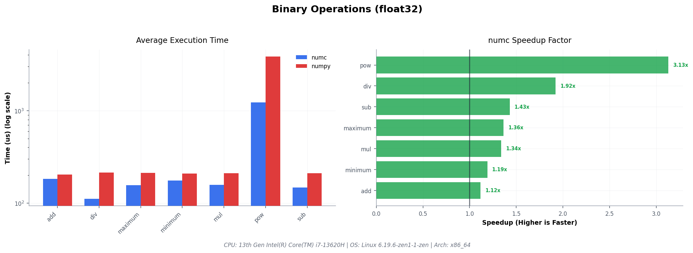

#### Ternary Operations (fma, etc.)
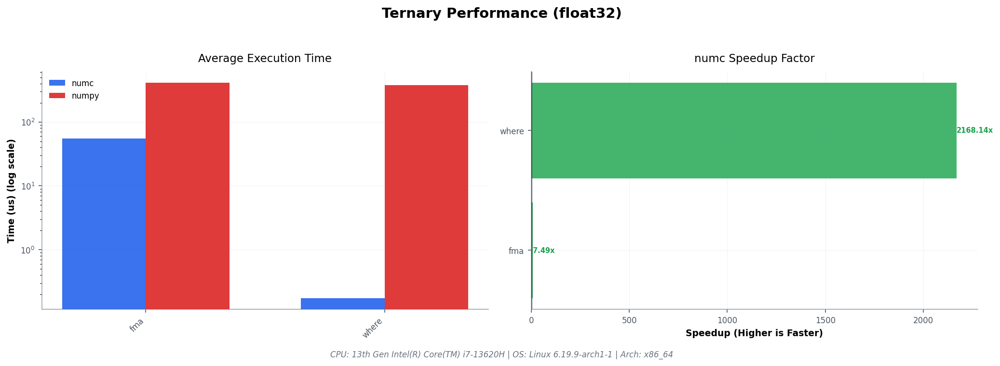

#### Matrix Multiplication (GEMM)
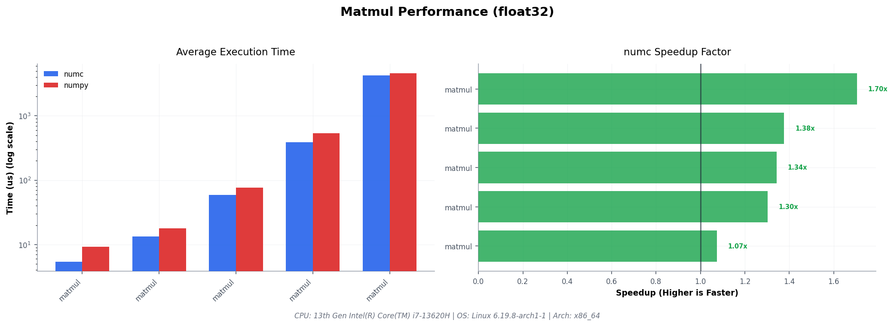

#### Reductions (sum, mean, max, dot, etc.)
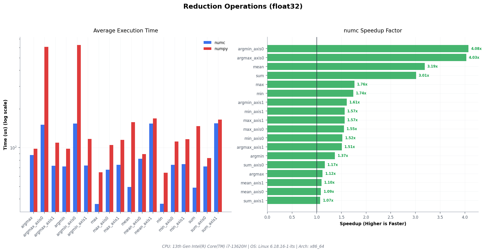

#### Unary Operations (exp, log, sqrt, etc.)
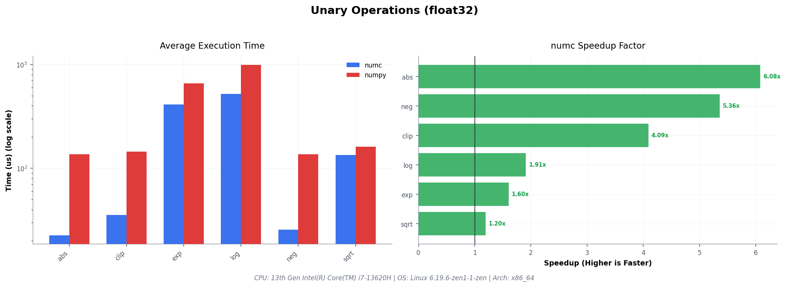

#### Inplace Operations (unary and scalar)
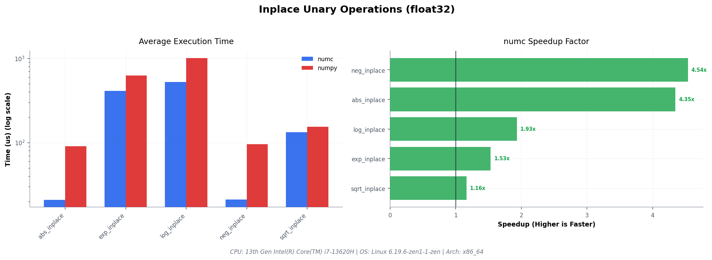
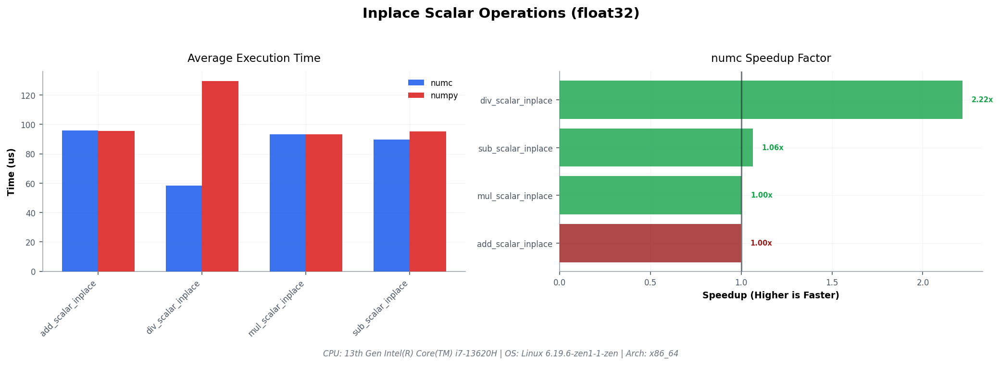

#### Scalar Operations (array op scalar)
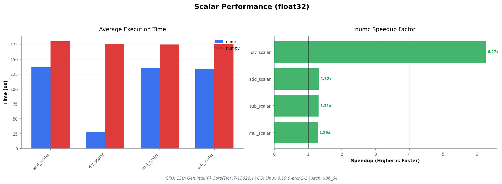

#### Comparisons (array vs array and array vs scalar)
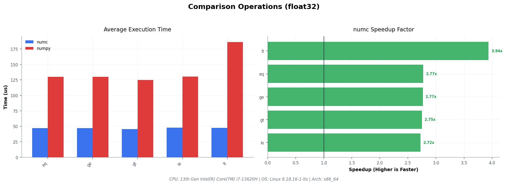
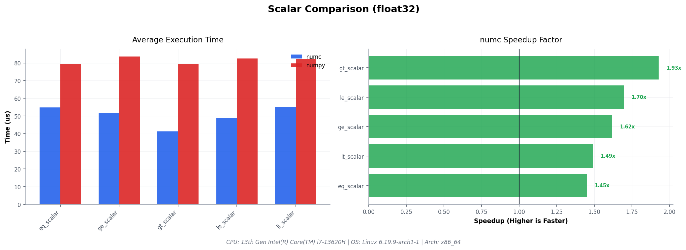

#### Random Number Generation
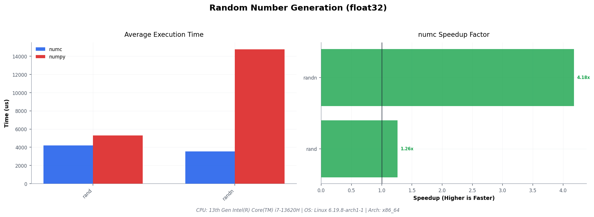

---

### 3. Data Type Scalability
This chart demonstrates how `numc` performance scales across bit-widths (e.g., comparing 8-bit integers to 64-bit floats).

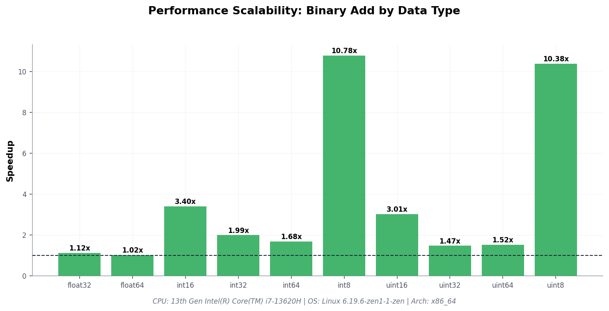

---

### 4. Detailed Operation List
A comprehensive breakdown of speedups for every single benchmarked operation.

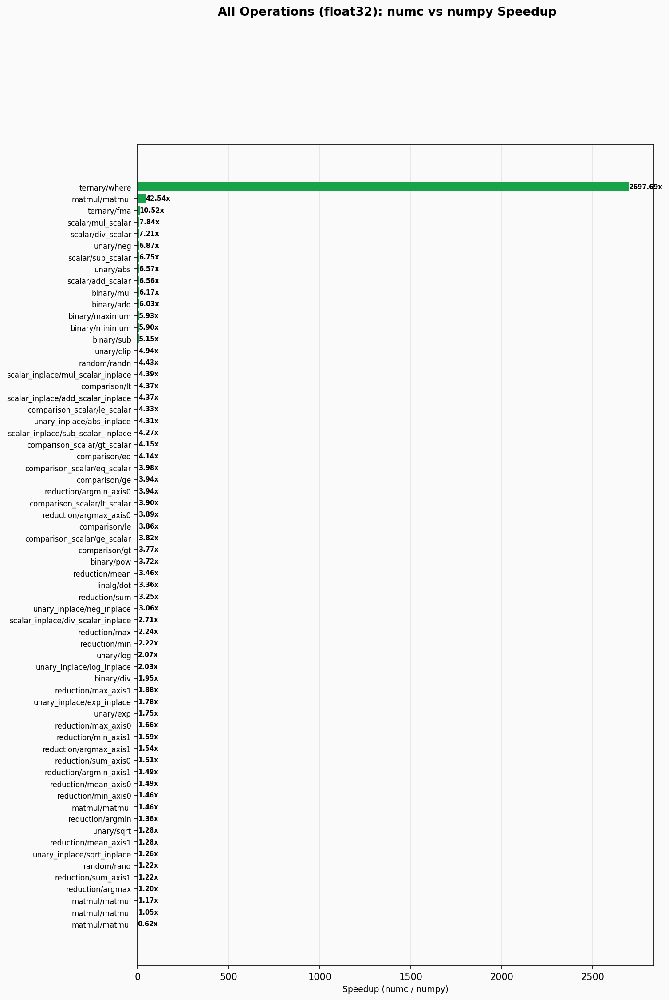

---

## Technical Features

### System Metadata
The plotting script automatically probes your system to include a "Hardware Footer" on every chart. This ensures results are context-aware:
- **CPU:** Precise model name (via `lscpu`).
- **OS:** Kernel version and distribution.
- **Arch:** System architecture (x86_64, AArch64, etc.).

### Automatic Scaling
Charts use an intelligent Y-axis:
- **Linear Scale:** Used for most comparisons to maintain visual intuition.
- **Log Scale:** Automatically engaged when the performance delta between `numc` and NumPy exceeds 10x, preventing small bars from disappearing.

### Professional Palette
- **Blue (#2563eb):** Represents `numc`.
- **Red (#dc2626):** Represents NumPy.
- **Green/Dark-Red:** Used in speedup charts to immediately distinguish between performance gains and regressions.
